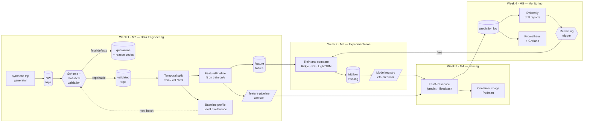

# ETA-Prediction-ML-Pipeline

End-to-end machine learning pipeline for **delivery / ride ETA prediction**, built for
the BITS Pilani WILP course **Machine Learning Engineering (PCAM\* ZC412)** — EC-1
Mini-Project, Flavor A.

The system ingests trip data, validates it, engineers time-, weather- and
location-based features, trains and compares models to predict trip duration, serves
the best model behind a REST API, and monitors it for drift with an automated
retraining trigger.

## Team

| Name | ID |
| --- | --- |
| Santosh | 2025paml516 |
| Sharavanan | 2025paml517 |
| Chandra | 2025paml518 |

## Architecture



DVC drives the Week 1 stages, and the same `dvc repro` invocation is what the Week 4
retraining trigger calls to rebuild the model.

## Repository layout

```
├── params.yaml               # single source of truth for every stage
├── dvc.yaml / dvc.lock       # pipeline definition + reproducible state
├── src/
│   ├── config.py             # path + parameter loading
│   ├── utils/                # geo maths, NYC calendar, logging
│   ├── data/                 # generation, validation, schema, splitting
│   └── features/             # the shared FeaturePipeline
├── tests/                    # validation, feature and skew guards
├── reports/                  # graded artefacts, kept in Git
└── data/                     # DVC-tracked, not in Git
```

## Setup

Requires **Python 3.11** and, from Week 3, **Podman**.

```powershell
py -3.11 -m venv .venv
.\.venv\Scripts\Activate.ps1
pip install -r requirements.txt
```

Exact resolved versions are pinned in `requirements.lock.txt`.

## Reproduce the pipeline

```powershell
dvc repro          # generate -> validate -> split -> features -> profile -> train
dvc push           # store data artefacts in the configured remote
dvc metrics show   # headline model metrics
pytest             # guards over validation, features, statistics, skew and models
ruff check .
```

`dvc repro` is deterministic: the seed lives in `params.yaml`, so the same commit
always rebuilds the same dataset. Changing a threshold in `params.yaml` invalidates
only the stages downstream of it.

Browse the experiments with `mlflow ui --backend-store-uri mlruns`.

## Week 1 (M2) — data engineering results

| Metric | Value |
| --- | --- |
| Rows generated | 150,450 |
| Rows validated | 145,549 |
| Rows quarantined | 4,901 (3.26%) |
| Schema contract | PASSED |
| Engineered features | 43 |
| Train / val / test | 101,885 / 21,832 / 21,832 |

Full breakdown: [reports/validation/validation_report.md](reports/validation/validation_report.md).

### Data quality handling

Validation is organised as the four levels of M2 section 2.5:

| Level | Check | Implementation |
| --- | --- | --- |
| 1 | Schema — columns, dtypes, required fields | pandera contract in [src/data/schema.py](src/data/schema.py) |
| 2 | Range and domain — bounds, allowed values | [src/data/validate.py](src/data/validate.py) |
| 3 | Statistical — KS, chi-squared and mean shift vs. a training baseline | [src/data/statistical_validation.py](src/data/statistical_validation.py) |
| 4 | Business rules — compound, cross-field constraints | [src/data/validate.py](src/data/validate.py) |

Level 3 needs a baseline built from the training partition, which is downstream of
validation, so it reports `skipped` on the first pass over a fresh dataset and runs on
every batch ingested afterwards.

Defects are then split into two classes, because treating them identically is how
pipelines quietly lose data:

| Class | Examples | Action |
| --- | --- | --- |
| **Fatal** | missing GPS, dropoff before pickup, impossible speed, duplicate id, cross-field contradiction | Quarantined with a reason code — never silently dropped |
| **Repairable** | missing weather, missing passenger count | Nulls carried forward and imputed by the feature pipeline, with the imputation recorded as a boolean feature |

The stage aborts the pipeline if the quarantine rate exceeds 15%: a spike means the
upstream feed changed shape, which is a different failure from ordinary noise.

All six data quality dimensions are measured per batch rather than collapsed into a
single rejection count — see
[reports/validation/data_quality_dimensions.md](reports/validation/data_quality_dimensions.md).
Accuracy is reported as *not directly measurable*, with implied-speed plausibility as a
proxy, because no rule can tell whether a recorded duration is the one that elapsed.

### Engineered features

| Group | Features |
| --- | --- |
| Geometry | haversine / manhattan distance, bearing (sin, cos), raw pickup + dropoff coordinates |
| Cyclical time | hour, day-of-week and month encoded as sin/cos pairs |
| Calendar | is_weekend, is_rush_hour, is_night, is_holiday |
| Conditions | traffic index, temperature, precipitation, wind, weather severity + one-hot |
| Trip metadata | passenger count, vendor one-hot, store-and-forward flag, imputation flags |
| Learned zone signals | zone centroids, same-zone flag, zone-hour and route speed priors, expected duration |

### Preventing training–serving skew

Both the training pipeline and the API import the same `FeaturePipeline` class and
load the same persisted artefact (`speed_priors.json`, `feature_spec.json`).
`tests/test_skew.py` asserts that a single-row transform through a reloaded pipeline is
bit-identical to the batched training transform, and `feature_spec.json` is checked on
load so a stale artefact fails fast instead of silently reordering columns.

The artefact is plain JSON, not a pickle. Zone assignment is nearest-centroid, so only
the centroids need to be stored — which keeps the serving path free of arbitrary-code
deserialisation and decouples the container from the scikit-learn version used to train.

Imputation values live in the same artefact. They are learned from the training
partition, persisted, and applied inside `transform`, so serving never recomputes a
fill value from production data.

### Reproducibility

Running `dvc repro --force` twice produces byte-identical output for every data and
model artefact:

| Artefact | Stable across rebuilds |
| --- | --- |
| `trips_raw.parquet`, `trips_validated.parquet`, `quarantined_trips.parquet` | yes |
| `train/val/test.parquet`, `*_features.parquet` | yes |
| `models/feature_pipeline/` | yes |
| `trips_raw.meta.json`, `reports/validation/` | no — they embed a generation timestamp as provenance |

## Week 2 (M3) — experimentation results

Four candidates, tuned with `RandomizedSearchCV` over `TimeSeriesSplit` folds and
tracked in MLflow:

| Model | Train MAE | Val MAE | Test MAE | Test R² | Test p90 AE | Fit time |
| --- | --- | --- | --- | --- | --- | --- |
| **lightgbm** | 3.392 | **3.474** | 3.565 | 0.899 | 8.22 | 145.5s |
| random_forest | 2.611 | 3.509 | 3.596 | 0.898 | 8.25 | 215.6s |
| ridge | 3.894 | 3.828 | 3.951 | 0.882 | 8.60 | 10.6s |
| baseline (median) | 12.030 | 11.904 | 12.137 | -0.082 | 28.56 | 0.1s |

LightGBM cuts test MAE from the median baseline's 12.14 min to **3.56 min**, a 70.6%
improvement — that margin is what justifies operating a model at all. Full analysis:
[reports/model_comparison.md](reports/model_comparison.md).

Note the train-to-validation spread: Random Forest reaches 2.611 train MAE but only
3.509 on validation, while LightGBM moves 3.392 → 3.474. The forest is memorising the
training period; LightGBM generalises, and that is why it wins despite a nearly
identical headline score.

### Selection discipline

The winner is chosen on **validation**, never on test. `select_best` raises if the
configured selection partition is `test`, because a model picked by its test score
turns that score into a biased estimate of production error — precisely the number
the report exists to give honestly. Test is scored once.

Cross-validation inside the search is `TimeSeriesSplit`, not shuffled K-fold, for the
same reason the train/val/test split is temporal: shuffled folds train on later trips
to predict earlier ones, inflating the score through a mechanism that does not exist
in production.

Ridge is wrapped in `Pipeline([StandardScaler, Ridge])`. Its L2 penalty is
scale-dependent and this matrix mixes latitudes near 40.7 with sine terms near 1, so
without scaling the penalty lands almost entirely on the small-scale features. Scaling
inside the pipeline also refits the scaler per fold and serialises it with the model.

### Reproducing a run

```powershell
python -m src.models.reproduce_run --run-id <run_id>
```

This reads *only* MLflow — parameters, tags and recorded dataset hashes — refits, and
compares against the originally logged metrics, exiting non-zero on divergence. The
selected LightGBM run reproduces to a maximum delta of **0.0** across all nine tracked
metrics. Every run records its git commit, working-tree cleanliness and the DVC md5 of
each dataset consumed, so a run identifies the exact code and data behind it.

## Dataset

Synthetic, generated by `src/data/generate_synthetic.py` from a documented
data-generating process over an NYC-shaped geography (mixture-of-Gaussians hotspots
across Manhattan, Brooklyn, Queens, the Bronx, JFK and LaGuardia).

Synthetic data was chosen over the Kaggle NYC Taxi Trip Duration dump because the
brief requires weather and traffic features that the public dataset does not contain,
and because Week 4 drift simulation needs a *controllable* process — owning the
generator makes a festival surge a ground-truth intervention rather than a guess.
Rationale in full: [docs/design_decisions.md](docs/design_decisions.md).

## Roadmap

- [x] **Week 1 · M2** — ingestion, validation, feature pipeline, DVC versioning
- [x] **Week 2 · M3** — MLflow experiments, model comparison, run reproduction
- [ ] **Week 3 · M4** — FastAPI service, container image, latency benchmarks
- [ ] **Week 4 · M5** — drift simulation, Prometheus/Grafana monitoring, retraining trigger

## References

- T1: Robert Crowe et al., *Machine Learning Production Systems*, O'Reilly, 2024.
- T2: Andriy Burkov, *Machine Learning Engineering*, 2020.
- R1: Andrew P. McMahon, *Machine Learning Engineering with Python*, 2nd ed., Packt, 2023.

Libraries: pandas, NumPy, pandera, scikit-learn, DVC. NYC geography and monthly
climatology values are approximations of public NOAA / NYC OpenData figures.
