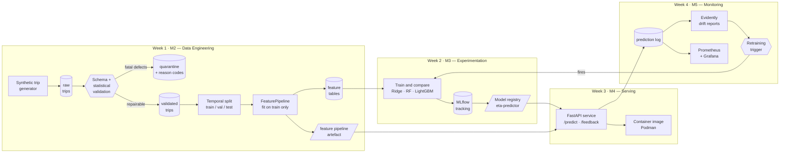

# ETA-Prediction-ML-Pipeline

End-to-end machine learning pipeline for **delivery / ride ETA prediction**, built for
the BITS Pilani WILP course **Machine Learning Engineering (PCAM\* ZC412)** — EC-1
Mini-Project, Flavor A.

The system ingests trip data, validates it, engineers time-, weather- and
location-based features, trains and compares models to predict trip duration, serves
the best model behind a REST API, and monitors it for drift with an automated
retraining trigger.

## Team

| Name | ID |
| --- | --- |
| Santosh | 2025paml516 |
| Sharavanan | 2025paml517 |
| Chandra | 2025paml518 |

## Architecture



DVC drives the Week 1 stages, and the same `dvc repro` invocation is what the Week 4
retraining trigger calls to rebuild the model.

## Repository layout

```
├── params.yaml               # single source of truth for every stage
├── dvc.yaml / dvc.lock       # pipeline definition + reproducible state
├── src/
│   ├── config.py             # path + parameter loading
│   ├── utils/                # geo maths, NYC calendar, logging
│   ├── data/                 # generation, validation, schema, splitting
│   └── features/             # the shared FeaturePipeline
├── tests/                    # validation, feature and skew guards
├── reports/                  # graded artefacts, kept in Git
└── data/                     # DVC-tracked, not in Git
```

## Setup

Requires **Python 3.11** and, from Week 3, **Podman**.

```powershell
py -3.11 -m venv .venv
.\.venv\Scripts\Activate.ps1
pip install -r requirements.txt
```

Exact resolved versions are pinned in `requirements.lock.txt`.

## Reproduce the pipeline

```powershell
dvc repro          # runs generate -> validate -> split -> features
dvc push           # store data artefacts in the configured remote
pytest             # guards over validation, features and skew
ruff check .
```

`dvc repro` is deterministic: the seed lives in `params.yaml`, so the same commit
always rebuilds the same dataset. Changing a threshold in `params.yaml` invalidates
only the stages downstream of it.

## Week 1 (M2) — data engineering results

| Metric | Value |
| --- | --- |
| Rows generated | 150,450 |
| Rows validated | 145,549 |
| Rows quarantined | 4,901 (3.26%) |
| Schema contract | PASSED |
| Engineered features | 43 |
| Train / val / test | 101,885 / 21,832 / 21,832 |

Full breakdown: [reports/validation/validation_report.md](reports/validation/validation_report.md).

### Data quality handling

Defects are split into two classes, because treating them identically is how
pipelines quietly lose data:

| Class | Examples | Action |
| --- | --- | --- |
| **Fatal** | missing GPS, dropoff before pickup, impossible speed, duplicate id | Quarantined with a reason code — never silently dropped |
| **Repairable** | missing weather, missing passenger count | Imputed from month-level statistics, with the imputation recorded as a boolean feature |

The stage aborts the pipeline if the quarantine rate exceeds 15%: a spike means the
upstream feed changed shape, which is a different failure from ordinary noise.

### Engineered features

| Group | Features |
| --- | --- |
| Geometry | haversine / manhattan distance, bearing (sin, cos), raw pickup + dropoff coordinates |
| Cyclical time | hour, day-of-week and month encoded as sin/cos pairs |
| Calendar | is_weekend, is_rush_hour, is_night, is_holiday |
| Conditions | traffic index, temperature, precipitation, wind, weather severity + one-hot |
| Trip metadata | passenger count, vendor one-hot, store-and-forward flag, imputation flags |
| Learned zone signals | zone centroids, same-zone flag, zone-hour and route speed priors, expected duration |

### Preventing training–serving skew

Both the training pipeline and the API import the same `FeaturePipeline` class and
load the same persisted artefact (`zone_kmeans.joblib`, `speed_priors.json`,
`feature_spec.json`). `tests/test_skew.py` asserts that a single-row transform through
a reloaded pipeline is bit-identical to the batched training transform, and
`feature_spec.json` is checked on load so a stale artefact fails fast instead of
silently reordering columns.

## Dataset

Synthetic, generated by `src/data/generate_synthetic.py` from a documented
data-generating process over an NYC-shaped geography (mixture-of-Gaussians hotspots
across Manhattan, Brooklyn, Queens, the Bronx, JFK and LaGuardia).

Synthetic data was chosen over the Kaggle NYC Taxi Trip Duration dump because the
brief requires weather and traffic features that the public dataset does not contain,
and because Week 4 drift simulation needs a *controllable* process — owning the
generator makes a festival surge a ground-truth intervention rather than a guess.
Rationale in full: [docs/design_decisions.md](docs/design_decisions.md).

## Roadmap

- [x] **Week 1 · M2** — ingestion, validation, feature pipeline, DVC versioning
- [ ] **Week 2 · M3** — MLflow experiments, model comparison, run reproduction
- [ ] **Week 3 · M4** — FastAPI service, container image, latency benchmarks
- [ ] **Week 4 · M5** — drift simulation, Prometheus/Grafana monitoring, retraining trigger

## References

- T1: Robert Crowe et al., *Machine Learning Production Systems*, O'Reilly, 2024.
- T2: Andriy Burkov, *Machine Learning Engineering*, 2020.
- R1: Andrew P. McMahon, *Machine Learning Engineering with Python*, 2nd ed., Packt, 2023.

Libraries: pandas, NumPy, pandera, scikit-learn, DVC. NYC geography and monthly
climatology values are approximations of public NOAA / NYC OpenData figures.
